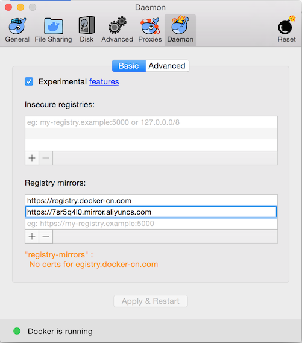

## Docker

### 一、安装

#### 使用 Homebrew 安装
	$ brew cask install docker
	
#### 手动下载安装
- Docker for Mac [stable](https://download.docker.com/mac/stable/Docker.dmg)

> 启动终端后，通过命令可以检查安装后的 Docker 版本。

	$ docker --version
	Docker version 18.03.1-ce, build 9ee9f40
	$ docker-compose --version
	docker-compose version 1.21.1, build 5a3f1a3
	$ docker-machine --version
	docker-machine version 0.14.0, build 89b8332
> Docker for Mac 已经包含了 Compose 了, 所以 Mac 用户不用单独安装Compose了。

### 二、镜像
#### 镜像加速器

> 配置阿里云加速器
> 
> 访问 https://dev.aliyun.com/search.html 并注册
> 
> 获取加速地址 https://xxxxxx.mirror.aliyuncs.com
> 
> docker for mac，选择 `Preferences` ，在 `Daemon` 标签下的 Registry mirrors 列表中将 加速地加到"registry-mirrors"的数组里，点击 `Apply & Restart`按钮，等待Docker重启并应用配置的镜像加速器
> 
> 
	
	$ cat .docker/daemon.json
	{
  		"debug" : true,
  		"registry-mirrors" : [
   		 	"https://registry.docker-cn.com",
    		"https://7sr5q4l0.mirror.aliyuncs.com"
  		],
 	 	"experimental" : true
	}

#### 下载镜像
	$ docker pull learn/tutorial

### 三、搭建私有仓库
> 首先下载镜像
	
		$ docker pull registry
		
> 下载后通过该镜像启动一个容器
		
		$ docker run -d -p 5000:5000 registry	
- With `docker info` I get
	
		Containers: 8
		...
		Server Version: 18.03.1-ce
		Storage Driver: overlay2
 		...
		Docker Root Dir: /var/lib/docker
		Debug Mode (client): false
		Debug Mode (server): true
		...
		
		https://stackoverflow.com/questions/38532483/where-is-var-lib-docker-on-mac-os-x

#### hello world
	$ docker run learn/tutorial echo "hello word"

##### 参考文档
- [Docker 教程](http://www.runoob.com/docker/docker-tutorial.html)
- [mac下docker的搭建和使用](http://blog.51cto.com/13673090/2092462)

