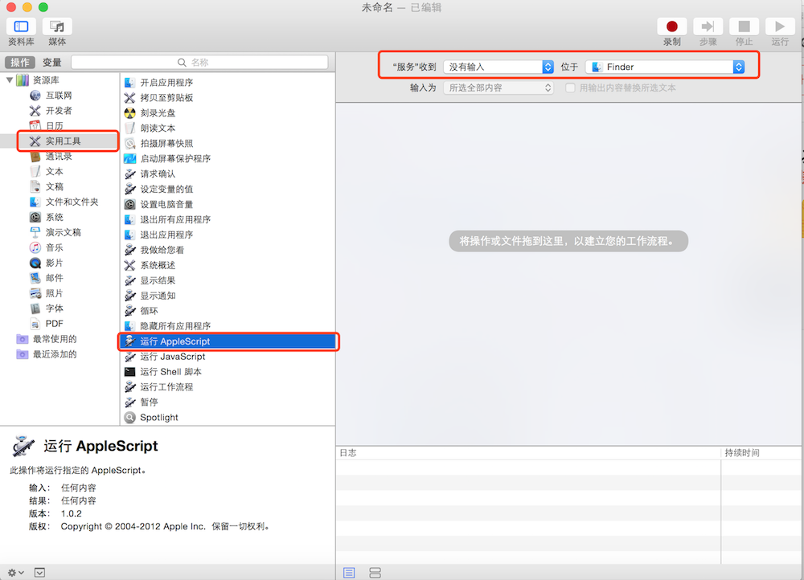
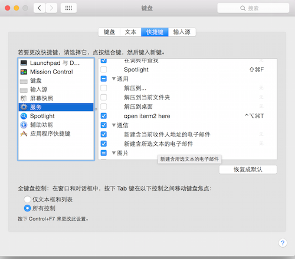

## Mac下 Finder当前目录打开iTerm2

> 本地环境
> 
- MacBook Pro 10.10.5

### 配置Automator方法（推荐）
1、打开`Automator`，如下图：这个小机器人

2、选择`服务`，如下图：

3、服务收到设为 `没有输入`，位置设为 `Finder`；从左侧的资源库中找出 `运行AppleScript`，拖到右侧，然后保存为`open iterm2 here`，点击 `运行`

4、在刚建的 `AppleScript` 的输入框输入以下代码
	
	on run {input, parameters}

    	tell application "Finder"

        	set pathList to (quoted form of POSIX path of (folder of the front window as alias))

        	set command to "clear; cd " & pathList

   	 	end tell

    	tell application "System Events"

        	-- some versions might identify as "iTerm2" instead of "iTerm"

        	set isRunning to (exists (processes where name is "iTerm")) or (exists (processes where name is "iTerm2"))

    	end tell

    	tell application "iTerm"

        	activate

        	set hasNoWindows to ((count of windows) is 0)

        	if isRunning and hasNoWindows then

           	 create window with default profile

        	end if

        	select first window

        	tell the first window

            	if isRunning and hasNoWindows is false then

             	   create tab with default profile

           	 end if

           	 tell current session to write text command

       	 	end tell

    	end tell

	end run

- 代码意思是将当前最前面的Finder地址如果获取不到，则返回桌面地址，然后通知iTerm的第一个窗口新建标签并跳到这个目录去

- [代码参考](https://github.com/LeEnno/alfred-terminalfinder/blob/master/src/fi.scpt.txt)

5、设置下快捷键 `设置`->`键盘`->`快捷键`，就可以快速在Finder中通过iTerm2打开目录了

> 参考文档
>
- [Mac 配置Finder当前目录打开iTerm2](https://www.jianshu.com/p/445d3f754c4d) 

