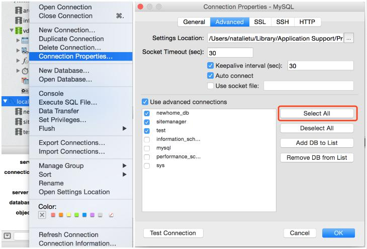

> 系统环境
>
-  Mac Pro OSX 10.10.5
-  Mysql 5.7.22 Homebrew
-  Navicat 11.0.6 standard

> 场景：Navicat连接本地localhost数据库，可以Connection Successful，但是每个库都仅显示一张数据表，而终端运行mysql命令可以正常看到所有表；网上查了很久没找到合适的解决方案，尝试了以下两种就解决方案，第二种顺利解决问题。

### 尝试一

> 解决过程：开始以为是数据库权限问题或者Navicat权限问题，查了很久资料，也修改了本地localhost的root的最大权限，依然没有解决。偶尔在网上看到了一个关于Navicat的`链接属性设置`，如下图：
 
 
> 解决结果：复选框选中的数据库才会在Navicat显示，但是最终并没有解决每个库只显示一个表的问题。

### 尝试二

> 解决过程：尝试对唯一的一张数据表做一些操作的时候，弹出`Table ‘performance_schema.session_variables’ doesn’t exist`，可能原因：mysql版本升级了，需要Navicat同步upgrade

> 执行过程
	
	
	第一步：
	$ mysqld_upgrage -u root -p --force
	Enter password:
	Checking server version.
	Running queries to upgrade MySQL server.
	Checking system database.
	mysql.columns_priv                                 OK
	mysql.db                                           OK
	mysql.engine_cost                                  OK
	......
	......
	......
	Upgrade process completed successfully.
	Checking if update is needed.
	
	第二步：
	重启mysql服务
	$ sudo /usr/local/Cellar/mysql/5.7.13/support-files/mysql.server restart
	
 
> 解决结果：顺利解决问题，能正常显示所有库表了！

##### 参考文档
- [navicat里的数据库隐藏不显示](https://blog.csdn.net/superit401/article/details/53338059)
 